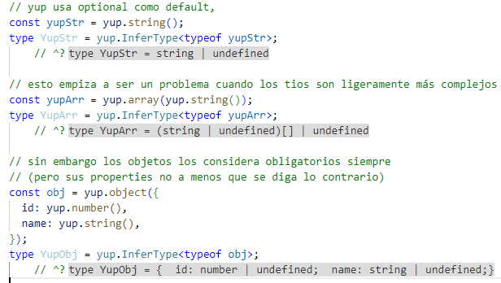
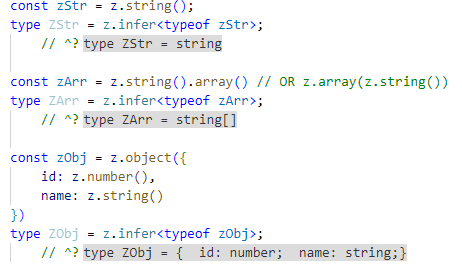
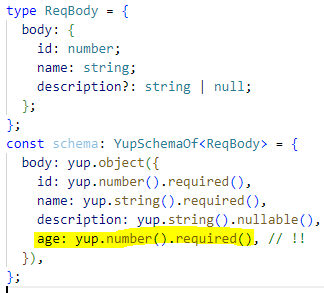
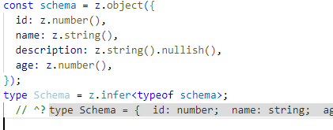
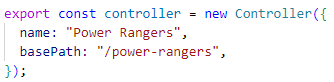
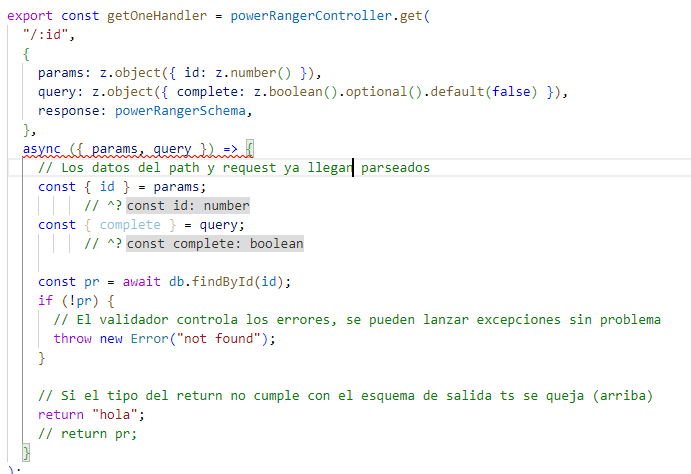
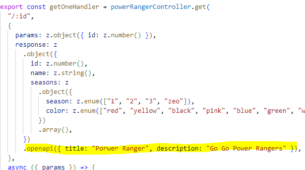

# Gen Z Validation
Demo de validador para express usando zod.
El objetivo es crear un validador con tipado más robusto y que requiera menos boilerplate.

El resultado es una extensión de la api de express en la cual, el único trabajo adicional para crear un endpoint validado y fuertemente tipado es escribir los esquemas de validación.

Además de la funcionalidad básica de validar entrada (y salida) de datos, el validador también genera la documentación de openapi de manera automática.

## Por que zod?
Zod fue escrito desde un inicio con typescript en primer plano, por lo que no solo es el tipado superior, si no que su api es mucho más similar a los tipos de typescript, haciendolo mucho más intuitivo de usar.

Yup tiene varios gotchas muy incómodos

Zod simplemente funciona de la manera esperada

Mucho más facil de trabajar

**Nota:** La versión 1.0 de yup que salió el mes pasado mejora inmensamente el tipado y es recomendable acutalizarse como mínimo (creo que el YupSchemaOf que se usa en el validador desaparece o cambia de nombre). Sigue siendo inferior a zod.

## El tipado debe ser inferido del esquema
En el validador actual se están tipando manualmente los esquemas antes de escribirlos. Esto además de ser el doble de trabajo puede llevar a errores de los cuales TS no se entera. 

En este ejemplo podemos ver que el tipo que hemos escrito no contiene el campo age que es obligatorio y ts no nos ha dicho nada ya que los tipos son en efecto compatibles pero si se valida ese esquema contra algo del tipo que hemos escrito fallará ya que no tiene el campo age que es requerido.

La solución es usar inferencia para obtener el tipado del los esquemas. No solo por ahorrarnos escribir el tipo manualmente, si no porque el esquema es lo que va a decidir finalmente si el dato es válido por lo que tiene más sentido obtener el tipado directamente de el.

## Validando
Para empezar a usar el validar basta con crear un Controller, que se engarga de extender la api de router.

Una vez creado el funcionamiento es practicamente igual que el del router, tenemos todos los metodos get, post, etc. La diferencia está en que pasaremos los esquemas de entrada y salida y la función de la ruta ya recive los datos de entrada directamente (input, query y body) parseados siguiendo los esquemas de validación.

Adicionalmente el controller devuelve el handler de la función que hemos usado. Con esto se debería poder seguir haciendo los test de la misma manera que se hacen ahora.

## Documentación automática
El validador es capaz de generar la documentación de openapi de manera automatica, esto no solo reduce la cantidad de trabajo significativamente si no que, al generarse a partir de los validadores la documentación será siempre auténtica y sin error humano.

Para ello me he ayudado de la librería @asteasolutions/zod-to-openapi que simplemente traduce un zod schema al formato json valido para openapi. No es la única librería que que haga esto (he probado un par más e incluso se puede hacer manualmente) pero esta extiende la api de zod para poder añadirle información relevante para los docs (titulos y descripciones) de manera muy sencilla.

